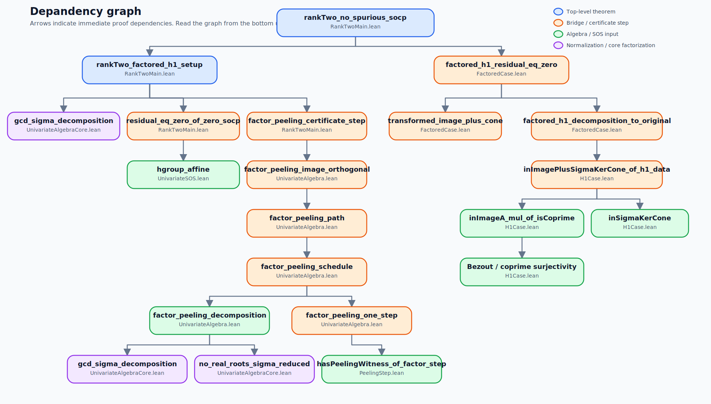

# LowRankUnivariateSOS

[](https://github.com/yuanchenyang/low_rank_univariate_sos/actions/workflows/lean_action_ci.yml)
[](https://github.com/yuanchenyang/low_rank_univariate_sos/actions/workflows/create-release.yml)

This directory contains a complete Lean 4 formalization of the rank-2 univariate
sum-of-squares landscape result from Benoît Legat, Chenyang Yuan, and Pablo A.
Parrilo, [*Low-Rank Univariate Sum of Squares Has No Spurious Local
Minima*](https://arxiv.org/abs/2205.11466), published in *SIAM Journal on
Optimization*, 33(3), 2023
([journal DOI](https://doi.org/10.1137/22M1516208)).

> Every second-order critical point of the rank-2 quadratic-penalty
> Burer-Monteiro objective has zero residual, hence is globally optimal.

In Lean, the top-level statement is
[`rankTwo_no_spurious_socp`](LowRankUnivariateSOS/RankTwoMain.lean#L116).

The formal theorem is slightly stronger than the paper statement: it is proved
for any positive-definite bilinear form `B : DotForm` on the polynomial space,
not just for a specific coefficient inner product.

## Build

```bash
cd low_rank_univariate_sos
lake build
```

## Main Files

- [`LowRankUnivariateSOS/PolynomialModel.lean`](LowRankUnivariateSOS/PolynomialModel.lean)
  Defines the polynomial pair model `UPair`, the quadratic map `sigma2`, the
  linear map `A_u`, and the SOS/image/kernel predicates used everywhere else.
- [`LowRankUnivariateSOS/Socp.lean`](LowRankUnivariateSOS/Socp.lean)
  Defines the abstract objective, FOCP/SOCP conditions, and basic consequences
  of first- and second-order criticality.
- [`LowRankUnivariateSOS/H1Case.lean`](LowRankUnivariateSOS/H1Case.lean)
  Formalizes the `h = 1` algebra: from coprimality plus a decomposition
  `p = g q + s σ(u₀)`, it produces the image-plus-kernel-cone decomposition
  used by the SOCP argument.
- [`LowRankUnivariateSOS/FactoredCase.lean`](LowRankUnivariateSOS/FactoredCase.lean)
  Turns transformed-image orthogonality and the `h = 1` decomposition into
  residual vanishing.
- [`LowRankUnivariateSOS/PeelingStep.lean`](LowRankUnivariateSOS/PeelingStep.lean)
  Encodes one peeling step and its iteration, matching the paper's repeated
  replacement of bad quadratic factors by `X²`.
- [`LowRankUnivariateSOS/UnivariateAlgebraCore.lean`](LowRankUnivariateSOS/UnivariateAlgebraCore.lean)
  Contains the gcd-based normalization `u = a · u₀`, coprimality of `u₀`, and
  the no-real-roots property of `σ(u₀)`.
- [`LowRankUnivariateSOS/UnivariateSOS.lean`](LowRankUnivariateSOS/UnivariateSOS.lean)
  Contains the SOS-specific algebra, especially the formal `hgroup_affine`
  lemma used in the `h = 1` reduction.
- [`LowRankUnivariateSOS/UnivariateAlgebra.lean`](LowRankUnivariateSOS/UnivariateAlgebra.lean)
  Builds the full factor-peeling reduction from the normalized factorization of
  `u`.
- [`LowRankUnivariateSOS/RankTwoMain.lean`](LowRankUnivariateSOS/RankTwoMain.lean)
  Contains the main theorem and the final bridge lemmas immediately used to
  prove it.

## Proof Outline

The formal proof follows the same three-stage structure as the paper.

### 1. Abstract SOCP consequences

For a polynomial pair `u = (u₁,u₂)`, define

- `sigma2 u = u₁^2 + u₂^2`
- `A u v = u₁ v₁ + u₂ v₂`
- `residual p u = sigma2 u - p`

The SOCP conditions say:

- first order: `residual p u` is orthogonal to `im(A_u)`
- second order: every `σ(w)` with `w ∈ ker(A_u)` pairs nonnegatively with the
  residual

This is the abstract optimization layer from the paper's first- and
second-order conditions.

### 2. Algebraic reduction of the pair `u`

Write

`u = a · u₀`

where `u₀` is reduced, meaning `u₀.fst` and `u₀.snd` are coprime. The theorem
[`gcd_sigma_decomposition`](LowRankUnivariateSOS/UnivariateAlgebraCore.lean#L28)
constructs this decomposition. Then
[`no_real_roots_sigma_reduced`](LowRankUnivariateSOS/UnivariateAlgebraCore.lean#L75)
proves the paper's key fact that `σ(u₀)` has no real roots.

This is the formal counterpart of the paper's decomposition into the coprime
part and the common factor.

### 3. The `h = 1` case

When the relevant common factor is coprime to `σ(u₀)`, the paper's hgroup lemma
shows that every SOS polynomial `p` can be written as

`p = g q + s σ(u₀)`

with `s` itself SOS. In Lean this is
[`hgroup_affine`](LowRankUnivariateSOS/UnivariateSOS.lean#L24).

From this decomposition and coprimality of `u₀`, the theorem
[`inImagePlusSigmaKerCone_of_h1_data`](LowRankUnivariateSOS/H1Case.lean#L149)
rewrites `p` as an image term plus a cone generated by kernel squares.

### 4. Factor peeling

In the general case, part of the common factor still interacts with `σ(u₀)`. The
paper peels these bad quadratic factors one by one, replacing each by `X²`
while preserving the orthogonality information needed for the SOCP argument.

In Lean:

- [`factor_peeling_decomposition`](LowRankUnivariateSOS/UnivariateAlgebra.lean#L78)
  splits the common factor into a coprime base factor plus peelable pieces.
- [`factor_peeling_one_step`](LowRankUnivariateSOS/UnivariateAlgebra.lean#L182)
  packages one quadratic replacement step.
- [`factor_peeling_schedule`](LowRankUnivariateSOS/UnivariateAlgebra.lean#L193)
  iterates the one-step procedure.
- [`factor_peeling_image_orthogonal`](LowRankUnivariateSOS/UnivariateAlgebra.lean#L223)
  gives the final transformed-image orthogonality used in the last step.

This is the formal analogue of the paper's condition `(C3)` and its iterative
proof.

### 5. Final reduction

The final file [`RankTwoMain.lean`](LowRankUnivariateSOS/RankTwoMain.lean) assembles the argument:

1. Normalize `u` by `gcd_sigma_decomposition`.
2. If the scale factor is zero, handle that degenerate branch directly by the
   SOCP inequalities.
3. Otherwise use
   [`factor_peeling_certificate_step`](LowRankUnivariateSOS/RankTwoMain.lean#L27)
   to get a transformed coprime image.
4. Apply
   [`hgroup_affine`](LowRankUnivariateSOS/UnivariateSOS.lean#L24)
   to obtain the `h = 1` decomposition.
5. Feed both ingredients into
   [`factored_h1_residual_eq_zero`](LowRankUnivariateSOS/FactoredCase.lean#L127),
   which proves the residual is zero.
6. Conclude `sigma2 u = p`, i.e. there are no spurious SOCPs.

## Dependency Graph

The main logical dependency chain is shown below:



Read this graph from the bottom up:

- the univariate algebra files construct the normalized pair and the peeling
  path;
- the SOS file supplies the hgroup decomposition;
- the `H1Case` and `FactoredCase` files turn those algebraic inputs into the
  image-plus-cone SOCP argument;
- `RankTwoMain` assembles the final theorem.

## Relation To The Paper

The Lean development follows the same proof path as the published paper:

- the coprime/Bézout reduction for the basic `h = 1` case
- the reduced-factor normalization `u = a · u₀` and the fact that `σ(u₀)` has no
  real roots
- the hgroup lemma, which rewrites an SOS polynomial as `g q + s σ(u₀)` when
  the relevant factor is coprime to `σ(u₀)`
- the factor-peeling argument, which iteratively replaces the bad quadratic
  factors by `X²`
- the final SOCP certificate argument showing that the residual must vanish

At a high level, the Lean files mirror the paper's main-proof section and its
certificate interpretation, but reorganize the argument into smaller reusable
lemmas aligned with the module structure above.
